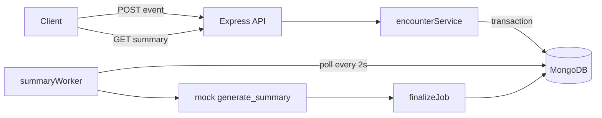
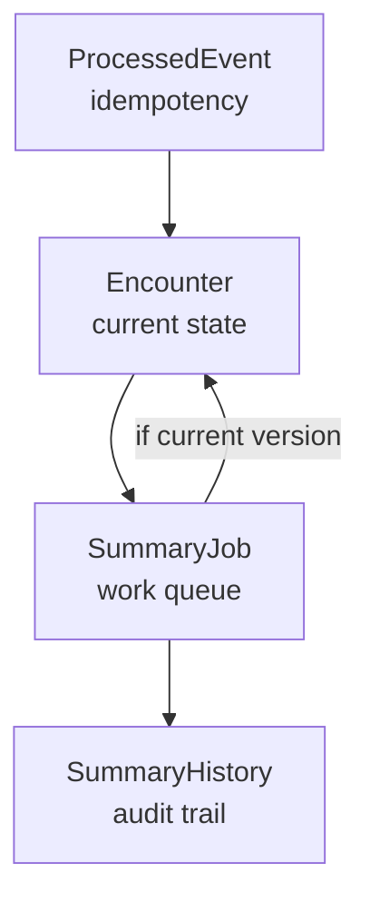

# Outcomes — Design Document

Clinical encounter ingestion service that accepts versioned visit updates, generates AI summaries asynchronously, and guarantees idempotency, crash recovery, and stale-result protection.

---

## 1. Overview

Partners send encounter events over HTTP. The service:

1. Validates and deduplicates each event
2. Updates the latest encounter state
3. Queues background summary work
4. Returns `201 ACCEPTED` before the summary is ready
5. Lets clients poll for the current summary or query history

Summary generation is **non-blocking**. Accepted work is **durable** — it survives process restarts because jobs live in MongoDB, not in memory.

---

## 2. API Contract

Base path: `/v1`

### 2.1 Ingest event

**`POST /v1/encounters/events`**

Request body (camelCase):

```json
{
  "eventId": "evt-501",
  "patientId": "pat-33",
  "encounterType": "Appointment",
  "version": 1,
  "encounterId": "optional-on-first-event",
  "payload": {
    "transcription": "Nurse: Good morning..."
  }
}
```

| Field | Required | Notes |
|---|---|---|
| `eventId` | Yes | Partner-supplied idempotency key |
| `patientId` | Yes | |
| `encounterType` | Yes | Must match on all updates to the same `encounterId` |
| `version` | Yes | Monotonically increasing per encounter |
| `payload.transcription` | Yes | Clinical text used for summary generation |
| `encounterId` | No | Omit on first event; server generates one |

**Success responses**

| HTTP | `code` | When |
|---|---|---|
| `201` | `ACCEPTED` | New or newer version accepted |
| `200` | `DUPLICATE` | Same `eventId`, or same `(encounterId, version)` under a different `eventId` |
| `200` | `STALE_IGNORED` | `version` ≤ stored version |
| `404` | `NOT_FOUND` | Unknown `encounterId` |
| `422` | — | `patientId` or `encounterType` mismatch for existing encounter |
| `400` | — | Missing required field |

`ACCEPTED` body:

```json
{
  "status": 201,
  "code": "ACCEPTED",
  "message": "Encounter event accepted for processing",
  "data": { "encounterId": "…", "version": 1 }
}
```

**Important:** `201` means the encounter was updated **and** a `SummaryJob` was queued atomically. It does **not** mean the summary is ready.

---

### 2.2 Get current summary

**`GET /v1/encounters/:encounterId/summary`**

Returns the **latest** summary state for the encounter (from `Encounter.latestSummaryData`).

```json
{
  "data": {
    "status": "PENDING | COMPLETED | FAILED",
    "summaryText": "…",
    "errorMessage": null,
    "queuedAt": "2026-09-28T08:00:00.000Z",
    "completedAt": "2026-09-28T08:00:07.000Z",
    "slaBreached": false,
    "slaBreachedAt": null
  }
}
```

Clients should poll until `status` is `COMPLETED` or `FAILED`.

---

### 2.3 Get summary history

**`GET /v1/encounters/:patientId/summary-history?encounterType=&encounterId=`**

Returns all finalized summary rows for a patient. Optional query params filter by encounter type or id.

```json
{
  "status": 200,
  "code": "SUCCESS",
  "message": "Summary history fetched successfully",
  "data": [
    {
      "encounterId": "…",
      "version": 1,
      "summaryText": "Summary text of the payload whose length is 86",
      "errorMessage": null
    }
  ]
}
```

Returns `404 NOT_FOUND` when no rows match.

---

## 3. Architecture



### 3.1 Ingest path

1. Fast pre-checks outside the transaction (duplicate `eventId`, encounter existence, identity match, stale version)
2. `commitAcceptedEvent()` — single MongoDB transaction:
   - Insert `ProcessedEvent`
   - Create or update `Encounter` (reset `latestSummaryData` to `PENDING`)
   - Create `SummaryJob` with frozen `transcription`
3. Return `201 ACCEPTED`

Transient transaction errors (catalog changes, write conflicts) are retried up to 3 times before surfacing an error.

### 3.2 Background worker

- Polls every **2 seconds** (`WORKER_POLL_INTERVAL_MS`)
- Atomically claims one `PENDING` job: `findOneAndUpdate` sets `PROCESSING`, increments `attempts`
- Calls mock `generate_summary` using the job's **immutable transcription snapshot**
- On success → `finalizeJob(COMPLETED)`
- On timeout/error → retry with backoff, or `FAILED` after max retries
- On startup → reset stuck `PROCESSING` jobs older than **2 minutes** back to `PENDING`

### 3.3 Finalize path

`finalizeJob()` always writes:

1. `SummaryJob` → terminal status (`COMPLETED` or `FAILED`)
2. `SummaryHistory` → audit row for that version

It updates `Encounter.latestSummaryData` **only if** `job.version === encounter.version` (version guard).

---

## 4. Data Model

Four collections, each with a distinct responsibility.



| Collection | Cardinality | Purpose |
|---|---|---|
| **ProcessedEvent** | 1 per accepted `eventId` | Idempotency — never updated after insert |
| **Encounter** | 1 per `encounterId` | Latest version + current summary for polling |
| **SummaryJob** | 1 per `(encounterId, version)` | Durable work queue with retry state |
| **SummaryHistory** | 1 per `(encounterId, version)` | Final result per version, including failures |

### 4.1 ProcessedEvent

```
eventId          (unique)
encounterId
version
patientId
encounterType
```

Indexes: unique on `eventId`; unique on `(encounterId, version)`.

### 4.2 Encounter

```
encounterId      (unique per document — one row per visit)
eventId          (last accepted event)
patientId
encounterType
version          (latest)
transcription    (latest)
latestSummaryData {
  status         PENDING | COMPLETED | FAILED
  summaryText
  errorMessage
  queuedAt, completedAt
  slaBreached, slaBreachedAt
}
```

### 4.3 SummaryJob

```
encounterId + version   (unique)
transcription           (immutable snapshot at accept time)
status                  PENDING | PROCESSING | COMPLETED | FAILED
attempts
nextRetryAt
summaryText, errorMessage
slaBreached, slaBreachedAt
queuedAt, startedAt, completedAt
```

Indexes: unique on `(encounterId, version)`; poll index on `(status, nextRetryAt)`.

### 4.4 SummaryHistory

```
patientId, encounterType, encounterId, version
summaryText, errorMessage
retryCount
queuedAt, completedAt
```

Index: unique on `(encounterId, version)`.

---

## 5. Configuration

Defined in `src/helper/constants.js`:

| Constant | Value | Meaning |
|---|---|---|
| `SLA_MS` | 10,000 ms | Simulated AI timeout threshold |
| `MAX_RETRIES` | 3 | Retries after initial attempt |
| `RETRY_BACKOFF_MS` | 2s, 4s, 8s | Delay before each retry |
| `WORKER_POLL_INTERVAL_MS` | 2,000 ms | Worker poll frequency |
| `STUCK_JOB_THRESHOLD_MS` | 120,000 ms | Crash recovery window |

---

## 6. Failure Scenarios

### Scenario 1 — Happy path

```
POST v1 (new encounter)
  → Transaction: ProcessedEvent + Encounter + SummaryJob
  → 201 ACCEPTED

GET /summary → { status: "PENDING" }

Worker claims job → generate_summary (5–10s)
  → finalizeJob(COMPLETED)
  → Encounter + SummaryHistory updated

GET /summary → { status: "COMPLETED", summaryText: "…" }
```

**Expected:** Client receives `201` immediately; summary becomes available after background processing.

---

### Scenario 2 — Duplicate event (same eventId)

```
POST eventId=evt-1  → 201 ACCEPTED
POST eventId=evt-1  → 200 DUPLICATE
```

**Mechanism:** Pre-check on `ProcessedEvent.findOne({ eventId })`, plus unique index inside the transaction as a safety net.

**Expected:** Exactly one accept. Second request writes nothing.

---

### Scenario 3 — Stale / out-of-order version

```
POST v10  → 201 ACCEPTED
POST v12  → 201 ACCEPTED
POST v11  → 200 STALE_IGNORED
```

**Mechanism:** Pre-check `version <= encounter.version`. Transaction update uses `{ version: { $lt: newVersion } }` to catch concurrent races.

**Expected:** Encounter stays at v12. v11 is ignored.

---

### Scenario 4 — Concurrent duplicate ingest

```
Promise.all([
  POST eventId=evt-X,
  POST eventId=evt-X
])
→ one 201 ACCEPTED, one 200 DUPLICATE
```

**Mechanism:** MongoDB unique index on `eventId`. One transaction commits; the other aborts with duplicate key `11000`.

**Expected:** Exactly one accept regardless of arrival order.

---

### Scenario 5 — Crash mid-processing

```
POST v1 → 201 ACCEPTED
Worker claims job → status PROCESSING
💥 Server crashes

Server restarts
  → recoverStuckJobs() resets PROCESSING jobs older than 2 min → PENDING
  → Worker picks up job again → COMPLETED
```

**Mechanism:** Job state is in MongoDB, not memory. `startedAt` + `STUCK_JOB_THRESHOLD_MS` detects orphaned claims.

**Expected:** Summary eventually completes; no manual intervention.

---

### Scenario 6 — Newer version arrives during processing

```
POST v12 → worker starts v12 job
POST v13 → Encounter moves to v13, summary reset to PENDING, new job queued
v12 job completes later
  → finalizeJob checks isCurrentVersion(v12) → false
  → v12 result saved to SummaryHistory only
  → Encounter stays on v13 PENDING
```

**Mechanism:** Version guard in `finalizeJob()`. Encounter updates use `{ encounterId, version }` filter.

**Expected:** Older results never overwrite newer state. Audit preserved in history.

---

### Scenario 7 — AI timeout and retry exhaustion

```
Worker runs generate_summary
  → simulated delay > 10s → timeout
  → scheduleRetry: history row with error, job back to PENDING
  → backoff 2s → retry (attempt 2)
  → timeout again → backoff 4s → retry (attempt 3)
  → timeout again → backoff 8s → retry (attempt 4)
  → attempts > MAX_RETRIES → finalizeJob(FAILED)

GET /summary → { status: "FAILED", errorMessage: "Timeout generating summary text" }
```

**Mechanism:** `MAX_RETRIES = 3` means 4 total attempts (initial + 3 retries). Encounter stays `PENDING` during retries.

**Expected:** Transient failures retry; permanent failure surfaces as `FAILED`.

---

### Scenario 8 — Partial ingest failure (transaction rollback)

```
POST v12
  → Transaction starts
  → ProcessedEvent inserted
  → Encounter updated
  → SummaryJob insert fails (or server crashes)
  → Transaction aborts — nothing persisted

Client receives 500 (or retries on transient error)
Client retries same eventId → 201 or DUPLICATE depending on whether anything committed
```

**Mechanism:** All three writes share one MongoDB session. `commitTransaction()` only runs if all succeed.

**Expected:** `201 ACCEPTED` is never returned unless the job is definitely queued.

---

## 7. Design Decisions & Tradeoffs

### 7.1 SummaryJob + polling worker vs inline generation

| | Inline (fire-and-forget) | SummaryJob + worker |
|---|---|---|
| Crash recovery | Lost | Job survives in DB |
| Retry scheduling | In-memory only | `nextRetryAt` in DB |
| Complexity | Low | Medium |

**Choice:** Persistent `SummaryJob` with a polling worker. Required for crash/retry scenarios in the assignment.

### 7.2 MongoDB transaction on ingest

**Pros:** `201 ACCEPTED` guarantees encounter + job were written together. No orphaned accepts.

**Cons:** Requires MongoDB replica set (not standalone). Slightly higher latency. Transient conflicts need retry logic.

**Choice:** Transaction is worth it for correctness. Local dev must use `mongod --replSet rs0`.

### 7.3 No SUPERSEDED job status

When v13 arrives while v12 is retrying, v12 keeps its full retry cycle instead of being cancelled.

| | Cancel in-flight (SUPERSEDED) | Version guard only |
|---|---|---|
| Wasted work | Less | Some |
| Audit completeness | May lose v12 result | v12 always lands in history |
| Encounter correctness | Same | Same (version guard) |

**Choice:** Version guard only. Simpler model; stale results go to history, never to `Encounter`.

### 7.4 Immutable transcription on SummaryJob

The worker reads `job.transcription`, not `Encounter.transcription`.

**Why:** If v13 updates the encounter while v12's job runs, v12 must still summarize the text it was accepted with.

### 7.5 SLA breach is a signal, not a failure

`slaBreached: true` is set when generation exceeds 10 seconds, but the job continues (or retries). This separates operational latency alerts from terminal failure.

### 7.6 API field naming

The assignment brief uses snake_case (`event_id`). This implementation uses camelCase (`eventId`) with transcription under `payload`. Documented as an assumption.

---

## 8. Observability

Structured JSON logs via `src/helper/logger.js`. One JSON object per line:

```json
{
  "timestamp": "2026-09-28T08:00:00.000Z",
  "level": "info",
  "component": "ingest.transaction",
  "message": "Transaction committed",
  "eventId": "evt-501",
  "encounterId": "…",
  "version": 1
}
```

### Log components

| Component | Stage |
|---|---|
| `server`, `worker` | Startup / shutdown |
| `ingest`, `ingest.transaction` | Event validation and atomic accept |
| `api.ingest`, `api.summary`, `api.history` | HTTP responses |
| `worker.claim`, `worker.process`, `worker.generate` | Job lifecycle |
| `worker.retry`, `worker.finalize`, `worker.sla` | Retries, completion, SLA |
| `worker.recovery` | Crash recovery |
| `summary.read`, `summary.history` | Read paths |
| `api.error` | Unhandled errors |

### What is never logged

- Transcription text
- Summary content
- Patient clinical data

This keeps logs safe for aggregation without PHI leakage.

---

## 9. Test Plan

Run: `npm test`

Stack: Jest, supertest, mongodb-memory-server (in-memory replica set).

| # | Test | File | Expected outcome |
|---|---|---|---|
| 1 | Happy path | `tests/encounters.test.js` | `201` → poll until `COMPLETED` |
| 2 | Duplicate eventId | same | First `201`, second `DUPLICATE` |
| 3 | Stale version (v10→v12→v11) | same | v12 accepted, v11 `STALE_IGNORED` |
| 4 | Concurrent duplicate | same | Exactly one `ACCEPTED`, one `DUPLICATE` |
| 5 | Crash recovery | same | Stuck `PROCESSING` → reset → `COMPLETED` |
| 6 | Version guard | same | Old job completes → history only, encounter unchanged |
| 7 | Retry exhaustion | same | All attempts fail → `FAILED` |

Tests use a mock AI (`setTestGenerateSummaryImpl`) for deterministic, fast execution. Production code path is unchanged.

---

## 10. Assumptions

1. **Version monotonicity** — Partners send increasing version numbers per encounter. Out-of-order events are ignored, not queued.
2. **At-least-once delivery** — Partners may retry the same `eventId`. Idempotency handles this.
3. **Single-region MongoDB** — No sharding or multi-region replication in scope.
4. **One worker process** — Polling worker runs in the same Node process as the API. Horizontal scaling would need distributed job claiming (e.g. change streams or a dedicated queue).
5. **Mock AI** — `generate_summary` is simulated with random 5–15s delay. No external API call.
6. **Replica set for transactions** — Required for ingest atomicity in production and dev.

---

## 11. Future Improvements (out of scope)

- Snake_case API adapter for assignment brief compatibility
- Separate worker process or Agenda/BullMQ for horizontal scaling
- Cancel in-flight jobs when superseded (product decision)
- Dead-letter queue for permanently failed jobs
- Metrics export (Prometheus/Datadog) alongside structured logs
